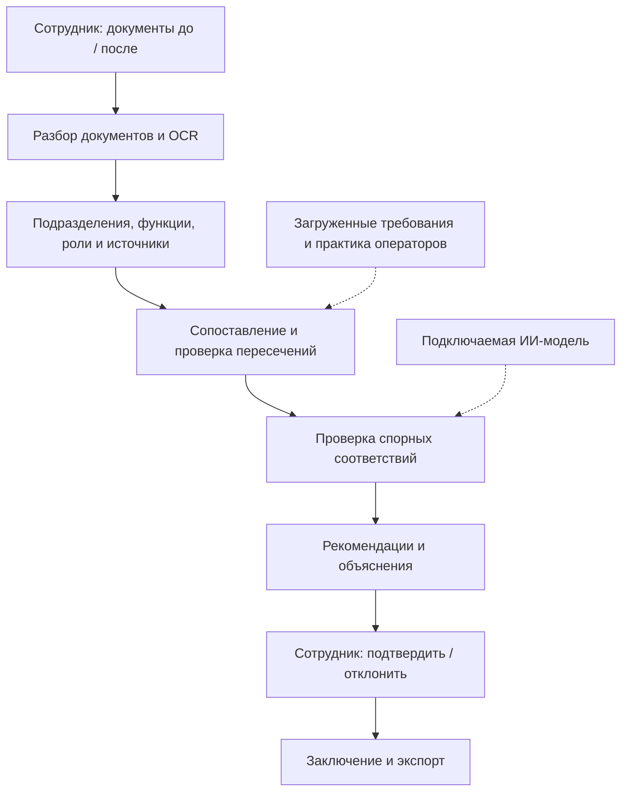

# OrgStruct AI

### Что происходит с функциями и ответственностью при реорганизации?

**OrgStruct AI** сопоставляет документы «до» и «после», показывает возможные потери функций, дублирование и конфликты интересов, а затем формирует заключение с источниками для проверки сотрудником.

**Команда AI-NAM · кейс «Анализ организационной структуры и функционала» · HackAlem**

**Работающий прототип · интерфейс и заключение RU / KZ · локальная обработка · подключаемая ИИ-модель**

Это мини-презентация для самостоятельного знакомства с решением: задача → демонстрация → устройство → проверка → развитие.

[Демонстрация](#demo) · [Архитектура](#architecture) · [Критерии оценки](#evaluation) · [Развитие](#roadmap) · [Запуск](#start) · [Ответы на вопросы](#faq)


*Экран анализа документов организатора. Представленные снимки интерфейса сделаны в режиме без ИИ-модели; числа на них относятся к конкретному запуску, а не к измеренной точности системы.*

## 1. Задача и пользователь

При реорганизации нужно установить, **какие подразделения изменились, куда перешли их функции и кто теперь отвечает за результат**. Ответы разбросаны по положениям, должностным инструкциям, схемам и приложениям к приказам.

Пользователь — сотрудник организационного развития, HR, внутреннего контроля или аудита. Его рабочий результат — проверенное заключение для согласования изменений.

| Без системы сотрудник должен | Что подготавливает OrgStruct AI |
|---|---|
| Найти прежнее и новое описание каждого подразделения | Сопоставление подразделений и схему изменений |
| Проверить передачу каждой функции, включая переформулированные | Матрицу функций «до / после» и кандидатов на потерю |
| Сверить обязанности разных подразделений | Возможные пересечения и несовместимые роли |
| Собрать доказательства и оформить выводы | Карточки с цитатами, рекомендациями и выгружаемое заключение |

**Вход:** Word, PDF, Excel, текстовые документы и изображения; дополнительно — предоставленные требования и материалы других операторов. **Выход:** матрица функций, схема изменений, выводы с источниками, рекомендации и отчёт. Полный [список форматов и зависимостей](docs/GUIDE.md#3-что-реализовано).

<a id="demo"></a>

## 2. Демонстрация: от документов к заключению

В репозитории есть два комплекта: **документы организатора** и **синтетический пример «ДемоТелеком»** с заранее заложенными изменениями. Их происхождение и контрольные наблюдения описаны в [samples/README.md](samples/README.md).

После [запуска](#start) войдите как аналитик и откройте соответствующий демо-проект. Если его ещё нет в списке, используйте **«Открыть демо-пример»**. При первом старте подготовка проектов выполняется в фоне.

| Шаг | Действие в интерфейсе | Что проверяет зритель |
|---|---|---|
| 1. Документы | Открыть комплекты «до» и «после», перейти к разобранному документу | Система работает с исходными файлами и сохраняет номера пунктов |
| 2. Оргструктура | Открыть «Оргструктура» → «Изменения» | Видны подразделения и предполагаемые связи с преемниками |
| 3. Анализ | Нажать «Перезапустить», открыть ход работы агента | Видны этапы обработки, их статус и журнал; результат вычисляется заново |
| 4. Доказательства | Открыть вывод и нажать ссылку на подтверждающий фрагмент | Открывается документ с подсвеченным пунктом |
| 5. Решение | Подтвердить или отклонить вывод, оставить комментарий | Проверка сотрудника сохраняется; отклонённые выводы исключаются из заключения |
| 6. Результат | Открыть «Заключение», выбрать RU/KZ и выгрузить отчёт | Получается документ для последующего согласования |

### Что должно обнаружиться на контрольном примере

Откройте **«Демо: реорганизация ИТ-блока АО „ДемоТелеком“»**.

| Изменение в документах | Ожидаемый результат | Практический смысл |
|---|---|---|
| Департамент ИТ разделён на Департамент цифровой инфраструктуры и Службу ИБ | Разделение прежнего подразделения и создание новых | Проверить распределение функций между преемниками |
| Разработка и актуализация ИТ-стратегии не закреплена в новой редакции | Потенциальная потеря функции, источник — положение о ДИТ, п. 3.1 | Уточнить владельца функции или основание её отмены |
| Мониторинг исполнения договоров закреплён за закупками и юридическим департаментом | Возможное дублирование | Разграничить исполнение, участие и контроль |
| Служба ИБ предоставляет доступ и проверяет правомерность его предоставления | Потенциальное совмещение выполнения и контроля | Проверить независимость контрольной роли |

Эти ожидания закреплены в [тестах контрольного сценария](backend/tests/test_demo_scenario.py). Это проверка конкретных случаев, а не обещание обнаружить все нарушения на любых документах.

**На документах организатора** можно проверить появление ДИТААД и ДОА, сохранение БВА, ДНМ и ДККМ и кандидатов на потерю прав из пунктов **5.6.2, 5.6.3 и 5.7.2**. Отдельно различаются общая и частная нормы и показывается устранённое двойное подчинение. [Проверки этого комплекта](backend/tests/test_organizer_scenario.py).


*Схема изменений поддерживает ручную правку структуры. При повторном анализе можно учитывать отредактированный вариант.*

### Что получает сотрудник

**DOCX / PDF** — аналитическое заключение; **XLSX** — таблица сопоставления; **JSON** — структурированные результаты. PDF требует LibreOffice, который включён в стандартный Docker-образ.

Дополнительно формируется **ZIP-пакет проектов документов**: положения о подразделениях на русском и казахском, схема PNG, документ об оргструктуре DOCX, реестр функций и штатная структура XLSX. Это материалы для проверки и согласования сотрудниками.


<a id="architecture"></a>

## 3. Как устроено решение и где используется ИИ



Агент последовательно выполняет **семь этапов**: разбор → извлечение структуры → сопоставление → требования и практика → проверка моделью → рекомендации → заключение. Для этапов сохраняются статус и журнал. [Оркестратор](backend/app/services/agent.py).

| Компонент | Реализация и роль |
|---|---|
| Интерфейс | React + TypeScript; React Flow для схем; рабочая область и отдельная админ-панель |
| API и хранение | Python + FastAPI + SQLAlchemy; SQLite по умолчанию, файлы в `DATA_DIR` |
| Документы | python-docx, PyMuPDF, openpyxl; Tesseract OCR и OpenCV для сканов и схем |
| Сопоставление | TF-IDF по основам слов и символьным фрагментам, пороги и правила; эмбеддинги подключаются отдельно |
| ИИ-модель | Через совместимый API проверяет выбранные соответствия и выводы, помогает с резюме и ответами по документам |
| Экспорт | DOCX, XLSX, JSON; PDF через LibreOffice; ZIP-пакет проектов документов |

**Почему возможен запуск без модели?** Базовый анализ строится на правилах и текстовом сходстве. ИИ добавляет смысловую проверку выбранных случаев. Вопросы агенту без модели возвращают найденные фрагменты; заключение формируется по шаблону.

**Как обеспечивается объяснимость?** Вывод связан с документом, пунктом и цитатой. Для резюме и ответов проверяются идентификаторы ссылок; при некорректных ссылках используется резервный ответ. Наличие ссылки подтверждает источник, но не гарантирует правильность интерпретации — решение проверяет сотрудник.

Подробнее: [архитектура и алгоритмы](docs/ARCHITECTURE.md), [подключение моделей](docs/MODELS.md).

## 4. Чем подход полезен и что уже реализовано

| Подход | Что он даёт | Подтверждение в проекте |
|---|---|---|
| Сравнение распределения функций вместе со структурой | Позволяет искать передачу функции между подразделениями и определять преобразования | [Движок сравнения](backend/app/analysis/compare.py) |
| Различение общей и частной нормы, прежних и новых пересечений | Даёт контекст для оценки дублирования | [Контрольные проверки](backend/tests/test_organizer_scenario.py) |
| Редактируемая схема → повторный анализ → пакет документов | Позволяет проверить подготовленный сотрудником вариант структуры и оформить проекты положений | [Редактор](frontend/src/pages/project/StructureTab.tsx), [генератор пакета](backend/app/docgen/package.py) |
| Требования и практика других операторов как отдельные комплекты | Расширяет сравнение за пределы двух редакций внутренних положений | [Дополнительные проверки](backend/app/analysis/extras.py) |
| Рекомендации, связанные с типом отклонения и преемниками | Предлагает действие: определить владельца, разграничить роли, отделить контроль | [Формирование рекомендаций](backend/app/analysis/recommend.py) |

Рекомендации сейчас формируются по правилам: для потерянной функции выбирается первый найденный преемник либо ближайший кандидат; для пересечения предлагается разграничение ролей. Проверка загрузки, компетенций и оптимальности такого назначения — следующий этап развития.

Сравнение с другими операторами использует **загруженные пользователем материалы**, а проверка требований ищет соответствия формулировкам. Система не выполняет самостоятельный сбор данных из интернета и не устанавливает юридическое соответствие.

<a id="evaluation"></a>

## 5. Как проверить проект по критериям кейса

| Критерий | Баллы | Что можно проверить самостоятельно |
|---|---:|---|
| Соответствие задаче и работоспособность | 25 | Два демо-комплекта: изменения структуры, потери, пересечения, источники и заключение |
| Техническая реализация | 25 | Семь этапов агента, разбор документов, правила, подключаемая модель и проверка ссылок |
| README и воспроизводимость | 25 | Запуск выбранной ветки, демо-доступ, ожидаемые результаты, тесты и подробное руководство |
| Ценность и применимость | 15 | Переход от вывода к пункту, решение аналитика, экспорт и проекты документов |
| Развитие и оригинальность | 10 | Редактируемая структура, повторный анализ, общие/частные нормы и план расширения ниже |

В [backend/tests](backend/tests) предусмотрены проверки обоих комплектов, разбора документов, HTTP API, ролей, экспорта и ИИ-режима с имитацией API модели. [GitHub Actions](.github/workflows/ci.yml) настроен на тесты, сборку интерфейса и Docker-образа. Текущее состояние запусков доступно во вкладке [Actions](https://github.com/BAITC-Hacks/hack-8cb43e3f-ai-nam/actions).

**Что ещё предстоит измерить на пилоте:** точность и полноту обнаружения каждого типа отклонений, число ложных тревог, время анализа вместе с ручной проверкой и долю принятых рекомендаций. Подтверждённых процентов экономии времени и качества реальной LLM пока нет.

<a id="roadmap"></a>

## 6. Потенциал развития и применения в масштабе

Следующие возможности — **план развития**, а не заявленные результаты текущей версии.

| Этап | Что добавить | Как оценить результат |
|---|---|---|
| Надёжность анализа | Экспертный набор документов, включая казахские; проверка извлечения и качества реальной модели | Отдельные метрики потерь, дублирования и конфликтов на новых документах |
| Симулятор реорганизации | Передача функции → проверка полномочий и независимости → сравнение вариантов → список нужных правок | Найдены последствия изменения до согласования; видно обоснование каждого варианта |
| Память организации | История ответственности по редакциям и повторное использование подтверждённых экспертных связей | Меньше повторных исправлений; прослеживается путь функции через несколько реорганизаций |
| Несколько подразделений и филиалов | Доступ по проектам, очередь задач, повторные запуски, общее хранилище и нагрузочные проверки | Разграничен доступ, задания восстанавливаются после сбоя, измерена работа при параллельной нагрузке |
| Корпоративные процессы | Интеграции с СЭД и HR-системой, версии по датам приказов, область ответственности по регионам | Анализируется нужная редакция; одноимённые функции разных филиалов различаются по области действия |

Ближайший продуктовый шаг — развить существующий редактор структуры в **симулятор последствий**: сотрудник предлагает изменение, система показывает затронутые функции, документы и новые риски.

<a id="start"></a>

## 7. Запустить и проверить без команды

**Нужен Docker с Compose v2.** Используйте ветку `claude/sleepy-brown-ql4mry`: в ней находится OrgStruct AI. Первый запуск требует скачивания образов и зависимостей.

```bash
git clone --branch claude/sleepy-brown-ql4mry https://github.com/BAITC-Hacks/hack-8cb43e3f-ai-nam.git
cd hack-8cb43e3f-ai-nam
docker compose up -d --build
```

Откройте **http://localhost:8000**. По умолчанию модель отключена, а два демо-проекта создаются и анализируются в фоне. Если обработка ещё идёт, дождитесь завершения на странице проекта.

| Для чего | Страница | Демо-логин | Демо-пароль |
|---|---|---|---|
| Пройти весь сценарий | `/login` | `analyst@example.com` | `analyst12345` |
| Просмотреть результаты | `/login` | `viewer@example.com` | `viewer12345` |
| Настроить модель, пользователей и правила | `/admin/login` | `admin@example.com` | `admin12345` |

Это данные для демонстрации. Для рабочего размещения задайте свои учётные данные и отключите демо-наполнение через `SEED_DEMO=false` до первого запуска.

**Без Docker:** [полная инструкция](docs/GUIDE.md#7-установка-и-запуск), включая PowerShell, локальную модель и команды тестирования. Для воспроизводимого окружения используйте версии CI: Python 3.11 и Node.js 22.

<details>
<summary>Если при демонстрации что-то не получилось</summary>

- **Страница не открылась:** проверьте `docker compose ps` и `docker compose logs app`; сборка и первичная подготовка могут ещё выполняться. Если порт занят, задайте `APP_PORT` в `.env` и используйте выбранный порт.
- **Демо-проекта нет:** нажмите «Открыть демо-пример»; автоматическое наполнение выполняется только при первом старте с пустой базой проектов.
- **Модель не подключена:** это штатный режим. Для смысловой проверки подключите сервер через «Панель администратора → ИИ-модель». [Инструкция](docs/MODELS.md).
- **PDF недоступен:** нужен LibreOffice; он входит в стандартную Docker-сборку. DOCX, XLSX и JSON доступны отдельно.
- **Скан распознан плохо:** проверьте качество изображения и исходный текст, затем исправьте извлечённую структуру в редакторе и повторите анализ.
- **Открылось другое приложение на порту 8765:** корневой `start.ps1` запускает второй прототип AI-NAM. Для OrgStruct AI используйте Docker либо `scripts\start.ps1`.

</details>

<a id="faq"></a>

## 8. Ответы на вопросы и границы версии

| Вопрос | Ответ |
|---|---|
| Нужны интернет, GPU и платный API? | Для базовой работы после установки — нет. Ресурсы для ИИ зависят от выбранной модели; облачный API необязателен. |
| Где хранятся документы? | В `DATA_DIR`, в Docker — в томе `app-data`; метаданные и результаты по умолчанию в SQLite. Облачная модель получает передаваемые ей фрагменты, если её подключить. |
| Кто видит проекты? | Сейчас все пользователи рабочей области видят все проекты. Есть роли администратора, аналитика и наблюдателя; доступа по отдельным проектам пока нет. |
| Система доказывает потерю функции или конфликт? | Нет. Она показывает кандидатов с источниками в загруженном комплекте. Полноту документов, область ответственности и вывод проверяет сотрудник. |
| Казахский язык поддерживается полностью? | Переведены интерфейс, заключение и шаблоны положений. Качество анализа казахоязычных исходников отдельно не проверено; текстовые правила ориентированы на русский. |
| Какие документы сложнее всего? | Нечёткие сканы, нестандартные схемы, неявно заданные исполнители и сильные перефразирования. OCR и смысловое сопоставление могут ошибаться. |
| Реальная ИИ-модель уже прошла оценку качества? | В репозитории есть тесты взаимодействия с имитацией API. Измеренного качества конкретной реальной модели на экспертном наборе пока нет. |
| Готово ли решение для большой организации? | Это прототип. Анализ выполняется в фоновом потоке; устойчивой очереди, горизонтального масштабирования и измеренной многопользовательской нагрузки пока нет. |
| Есть ли публичная рабочая ссылка? | Публичная версия не заявлена. Для проверки предусмотрены Docker, демо-комплекты, снимки интерфейса и сценарий выше. |

**Материалы:** [полное руководство](docs/GUIDE.md) · [архитектура](docs/ARCHITECTURE.md) · [модели](docs/MODELS.md) · [контрольные документы](samples/README.md) · [тесты](backend/tests).

В репозитории также сохранён отдельный облегчённый прототип **AI-NAM** (`app/`, `web/`, порт 8765). Его [инструкция](docs/AI-NAM.md) и тесты отделены от OrgStruct AI (`backend/`, `frontend/`, порт 8000).
