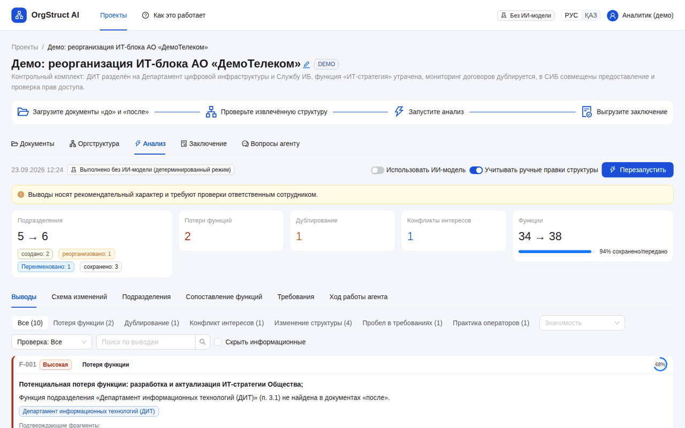
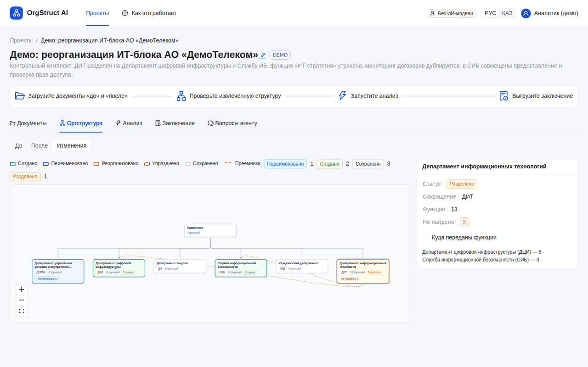
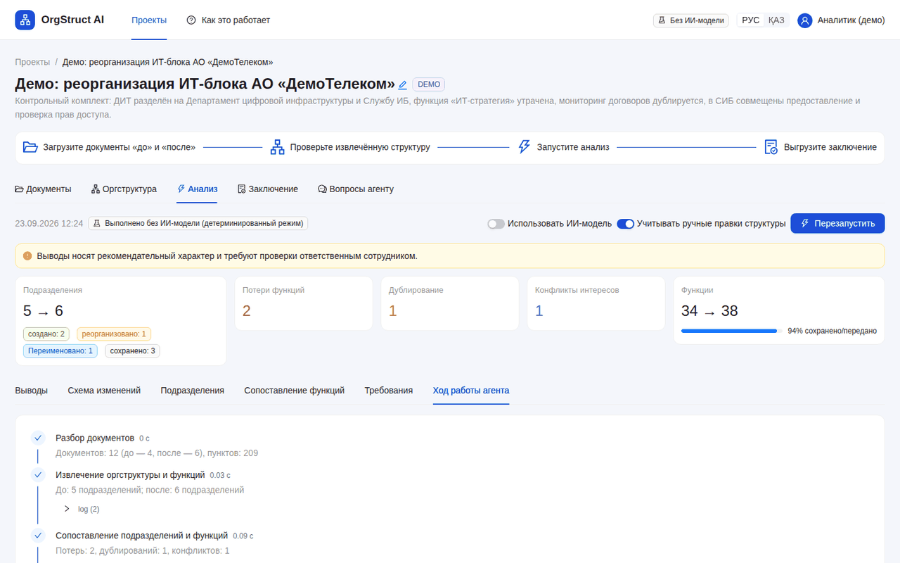
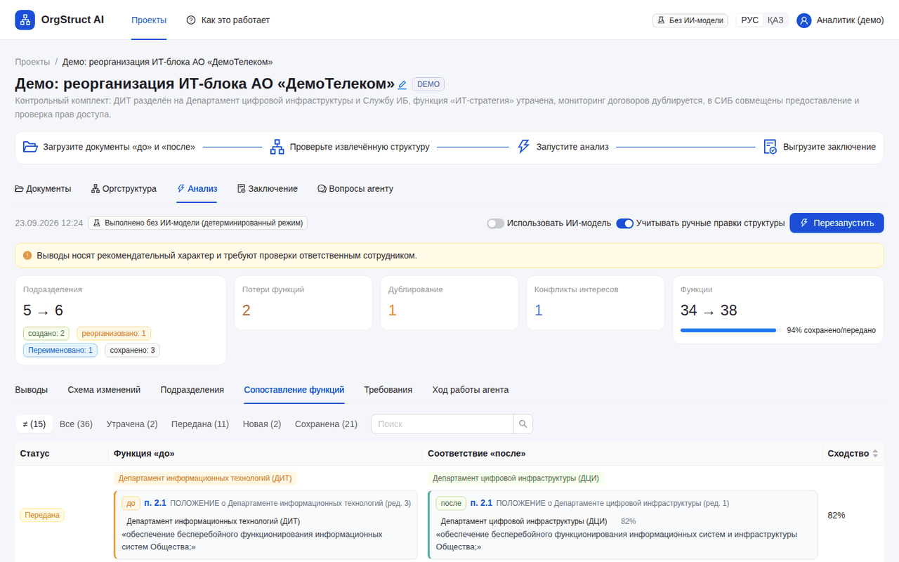
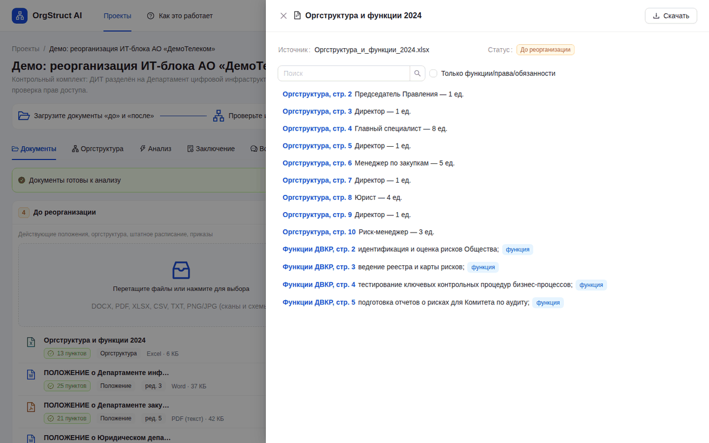
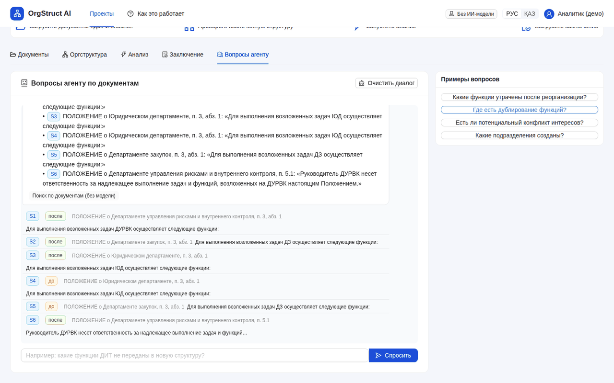
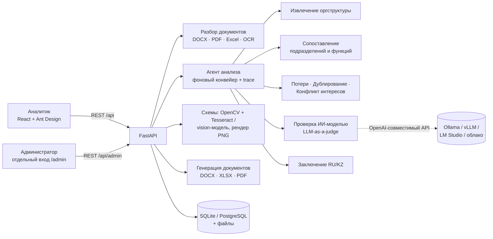
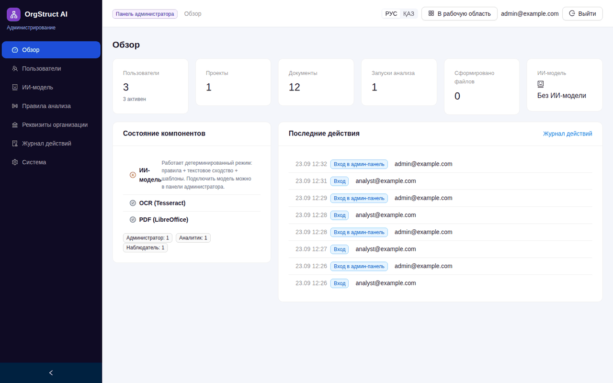
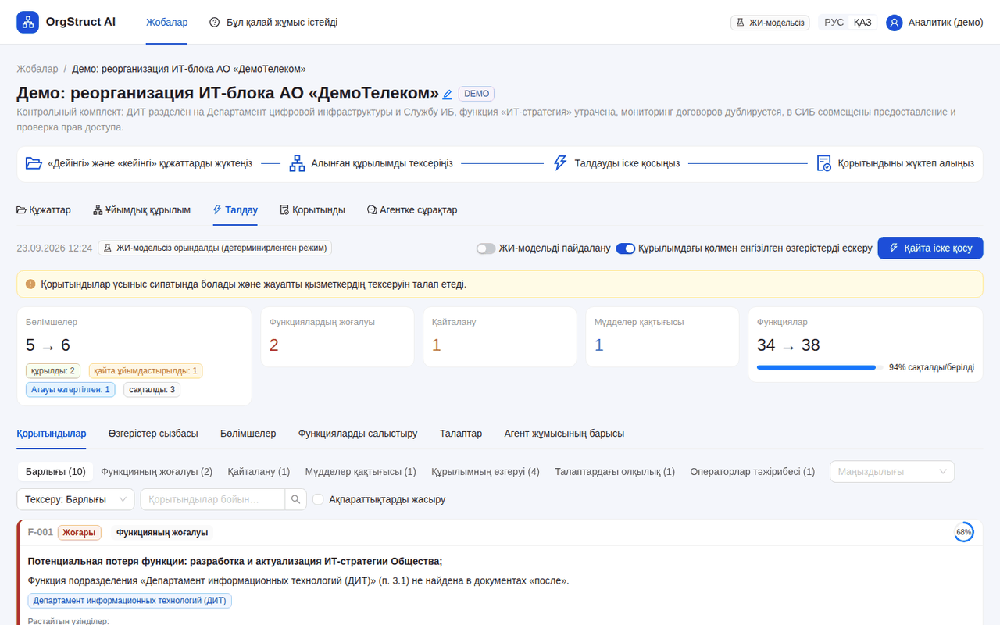

# OrgStruct AI — ИИ-агент анализа организационной структуры и функционала

> Хакатон HackAlem · кейс «ИИ-агент „Анализ организационной структуры и функционала“» · команда AI-NAM

Агент сравнивает комплекты документов **«до»** и **«после»** реорганизации (положения о подразделениях, оргструктуры,
штатные расписания, приказы, ВНД — Word, PDF, Excel, фото/сканы схем). Он определяет **созданные, сохранённые,
реорганизованные и упразднённые подразделения**, строит **таблицу сопоставления функций**, выявляет **потерю функций,
дублирование и потенциальный конфликт интересов**. Для каждого вывода агент показывает **документ и пункт-источник**
и формирует **объяснимое заключение** на русском или казахском языке.

Работает **без ИИ-модели**: правила, текстовое сходство и шаблоны. Любую **локальную или облачную модель** можно подключить
за минуту (Ollama, LM Studio, vLLM, llama.cpp, OpenAI-совместимые API). Модель усиливает анализ, но не может
добавить вывод без подтверждающего источника.



## Содержание

1. [Что реализовано (соответствие ТЗ)](#1-что-реализовано-соответствие-тз)
2. [Быстрый старт](#2-быстрый-старт)
3. [Подключение своей ИИ-модели](#3-подключение-своей-ии-модели)
4. [Как пользоваться](#4-как-пользоваться)
5. [Контрольный сценарий (п. 11 ТЗ)](#5-контрольный-сценарий-п-11-тз)
6. [Архитектура](#6-архитектура)
7. [Роли и панель администратора](#7-роли-и-панель-администратора)
8. [API, тесты, структура репозитория](#8-api-тесты-структура-репозитория)
9. [Ограничения и развитие](#9-ограничения-и-развитие)
10. [Қазақша қысқаша](#10-қазақша-қысқаша)

---

## 1. Что реализовано (соответствие ТЗ)

| Требование ТЗ | Как реализовано | Где увидеть |
|---|---|---|
| **Must 1.** Определить по приложениям, какие подразделения реорганизованы, сохранены, созданы | Извлечение оргструктуры из текста (определения «Департамент … (ДНМ)», перечни «состоит из», пункты «… подчиняются», заголовки «Положение о …»), таблиц Excel/Word и схем с фото. Статусы: *создано, сохранено, переименовано, разделено, реорганизовано, образовано слиянием, упразднено* | «Анализ → Подразделения», «Оргструктура → Изменения» (цветная схема «до/после») |
| **Must 2.** Сопоставить функционал преобразованных и существующих подразделений, выявить потерю функций | Карта функций «до → после»: *сохранена, передана (куда), изменена, утрачена, перенесена в общие положения, новая*. Гибридное сходство (основы слов + символьные n-граммы + опц. эмбеддинги) | «Анализ → Сопоставление функций», выводы «Потеря функции» |
| **Must 3.** Выявить дублирование функций и конфликт интересов | Дублирование между подразделениями (кластеры, отличие «общей и частной нормы», новое или унаследованное). Конфликт интересов: матрица разделения обязанностей (выполнение ↔ контроль, методология ↔ оценка, консультирование ↔ проверка по IIA 1130, подготовка ↔ утверждение, учёт ↔ распоряжение активами), двойное подчинение, явные нормы о КИ в тексте | Выводы «Дублирование», «Конфликт интересов» |
| **Must 4.** Для каждого вывода показать подтверждающий источник | Каждый пункт документа хранит номер (`5.3.2`, `пп. «а» п. 5.3.2`), раздел, субъект и страницу. Каждый вывод содержит фрагменты-источники; по клику открывается документ с подсветкой пункта | Карточки выводов → «Подтверждающие фрагменты» |
| **Must 5.** Итоговое аналитическое заключение | Заключение из 10 разделов (RU/KZ) со ссылками на пункты; экспорт DOCX / PDF / Excel / JSON | «Заключение» |
| **Опц. 1.** Соответствие законодательству, стандартам | Комплект «Требования»: сопоставление нормативных пунктов с функциями, пробелы | «Анализ → Требования», выводы «Пробел в требованиях» |
| **Опц. 2.** Сравнение с практикой других операторов | Комплект «Практика операторов»: поиск аналогичного подразделения и функций, которых нет у нас | Выводы «Практика операторов» |
| **Опц. 3.** Рекомендации по перераспределению функций | Рекомендация к каждому выводу: куда передать утраченную функцию, как разграничить дублирование, как устранить конфликт | Блок «Рекомендация» в карточках и раздел 9 заключения |
| **Ограничение.** Выводы рекомендательные, без неподтверждённых утверждений, с прослеживаемостью | Детерминированное ядро + LLM-as-a-judge только для проверки; резюме модели принимается, только если все ссылки `[F-xxx]` существуют. Сотрудник подтверждает или отклоняет каждый вывод, отклонённые исключаются из заключения. Журнал действий | Кнопки «Подтвердить / Отклонить», «Панель администратора → Журнал» |
| **Артефакты.** Прототип, интерфейс, README, архитектура | Веб-приложение (React + FastAPI), `docker compose up`, этот README, [docs/ARCHITECTURE.md](docs/ARCHITECTURE.md), [docs/MODELS.md](docs/MODELS.md), автотесты и CI | — |

Дополнительно по запросу команды:

- **Отдельная панель администратора** со своим входом (`/admin/login`): пользователи и роли, ИИ-модель (пресеты и проверка подключения), правила анализа, реквизиты организации, журнал действий, состояние системы.
- **Визуализация изменений оргструктуры**: совмещённая схема «до/после», где статусы подразделений выделены цветом, а стрелки ведут к преемникам.
- **Схема с фото или PDF → редактируемая оргструктура**: блоки и связи распознаются через OpenCV + Tesseract или vision-модель. Структуру можно править в редакторе: перенести блок мышью, чтобы сменить подчинённость, изменить название или функции.
- **Автоматический пакет документов**: проекты Положений о подразделениях (RU/KZ) с функциями и ссылками на исходные пункты, схема оргструктуры, документ об оргструктуре, реестр функций и штатная структура (Excel).
- **Вопросы агенту по документам**: ответы только по документам проекта, со ссылками `[S1]` на фрагменты.
- **Двуязычный интерфейс** RU/KZ.

## 2. Быстрый старт

### Вариант A. Docker (рекомендуется, одна команда)

```bash
git clone <URL репозитория> orgstruct-ai && cd orgstruct-ai
cp .env.example .env            # необязательно: без .env действуют значения по умолчанию
docker compose up -d --build    # первая сборка ~5–7 минут
```

Откройте **http://localhost:8000**. При первом запуске автоматически создаются демо-проект с контрольным комплектом
и результат его анализа.

| Вход | Адрес | Логин / пароль |
|---|---|---|
| Рабочая область (аналитик) | http://localhost:8000/login | `analyst@example.com` / `analyst12345` |
| Рабочая область (только просмотр) | http://localhost:8000/login | `viewer@example.com` / `viewer12345` |
| **Панель администратора** | http://localhost:8000/admin/login | `admin@example.com` / `admin12345` |

> Пароли задаются в `.env` (`ADMIN_EMAIL`, `ADMIN_PASSWORD`, `SEED_DEMO`). В рабочей среде смените их и отключите демо-пользователей: `SEED_DEMO=false`.

С локальной ИИ-моделью в том же compose:

```bash
# в .env: LLM_PROVIDER=openai, LLM_BASE_URL=http://ollama:11434/v1, LLM_MODEL=qwen2.5:7b-instruct, LLM_EMBED_MODEL=bge-m3
docker compose --profile ollama up -d --build   # поднимет Ollama и скачает модели
```

### Вариант B. Локально без Docker (Linux / macOS / Windows)

Требуется: **Python 3.11+** и **Node.js 20+**. Необязательно: **Tesseract OCR** с языками `rus` и `kaz` (для фото и сканов),
**LibreOffice** (для экспорта в PDF и чтения .doc/.rtf).

```bash
# Linux/macOS
make setup      # venv + pip install + npm ci + сборка интерфейса
make backend    # http://localhost:8000

# без make
python3 -m venv .venv && . .venv/bin/activate
pip install -r backend/requirements-dev.txt
(cd frontend && npm ci && npm run build)
cd backend && uvicorn app.main:app --port 8000
```

Windows (PowerShell): `powershell -ExecutionPolicy Bypass -File scripts\start.ps1`

Установка OCR: Ubuntu — `sudo apt install tesseract-ocr tesseract-ocr-rus tesseract-ocr-kaz`; macOS — `brew install tesseract tesseract-lang`;
Windows — [UB-Mannheim build](https://github.com/UB-Mannheim/tesseract/wiki), путь указать в `.env` (`TESSERACT_CMD`).

### Вариант C. Режим разработки

```bash
make dev        # backend :8000 (--reload) + Vite :5173 с hot reload; откройте http://localhost:5173
make test       # автотесты
```

## 3. Подключение своей ИИ-модели

Модель **необязательна**: без неё все функции работают в детерминированном режиме. С моделью агент дополнительно:

| Шаг | Что делает модель | Защита от «галлюцинаций» |
|---|---|---|
| Проверка пограничных выводов | Решает, одна ли это функция («same / partial / different»), подтверждает дублирование и конфликт | Видит только исходные формулировки; оспоренный вывод не удаляется, а помечается |
| Резюме заключения | Пишет краткое резюме для руководителя | Каждое утверждение обязано ссылаться на `[F-xxx]`; при неверной ссылке берётся шаблонное резюме |
| Вопросы агенту | Отвечает по найденным фрагментам | Обязательны ссылки `[S1]`; иначе показываются сами найденные фрагменты |
| Эмбеддинги (опц.) | Семантическое сходство функций | Смешивается с детерминированной метрикой |
| Vision (опц.) | Распознавание схем с фото | Результат попадает в редактор на проверку человеком |
| Перевод (опц.) | Функции на казахском для пакета документов | Без модели остаются на языке оригинала |

**Подходит любой OpenAI-совместимый сервер.** Настраивается в **Панели администратора → ИИ-модель** (кнопка
«Проверить подключение» показывает задержку и список моделей на сервере) или в `.env`:

| Сервер | `LLM_BASE_URL` | Пример `LLM_MODEL` |
|---|---|---|
| Ollama на своём ПК | `http://localhost:11434/v1` (из Docker: `http://host.docker.internal:11434/v1`) | `qwen2.5:7b-instruct` |
| Ollama из compose-профиля | `http://ollama:11434/v1` | `qwen2.5:7b-instruct` |
| LM Studio | `http://localhost:1234/v1` | имя загруженной модели |
| vLLM | `http://localhost:8001/v1` | `Qwen/Qwen2.5-7B-Instruct` |
| llama.cpp `llama-server` | `http://localhost:8080/v1` | любое |
| OpenAI / OpenRouter / др. | URL провайдера + `LLM_API_KEY` | `gpt-4o-mini` и т.п. |

Пример с Ollama:

```bash
ollama pull qwen2.5:7b-instruct   # текстовая модель (~4.7 ГБ)
ollama pull bge-m3                # эмбеддинги, хорошо работают с русским и казахским (необязательно)
ollama pull qwen2.5vl:7b          # vision для схем (необязательно)
```

Рекомендации по выбору модели под ваше железо: [docs/MODELS.md](docs/MODELS.md).
Проверить ИИ-режим без GPU можно на мок-сервере: `make mock-llm`, затем в админке укажите `http://localhost:11500/v1`, модель `mock-model`.

## 4. Как пользоваться

1. **Создайте проект** (или откройте демо-пример) → вкладка **«Документы»**: перетащите файлы в колонки
   *«До реорганизации»* и *«После реорганизации»*. Необязательные колонки: *«Требования»* (законы, стандарты)
   и *«Практика других операторов»*. Документы разбираются на пункты автоматически.
   
2. **«Оргструктура»**: проверьте подразделения, которые агент извлёк из документов, при необходимости поправьте их в редакторе
   или **распознайте схему с фото или PDF**. Режим **«Изменения»** показывает цветную схему «до/после».
   
   
3. **«Анализ» → «Запустить анализ»**: агент показывает ход работы по шагам. Результат: сводка, выводы с источниками
   и рекомендациями, таблицы подразделений и функций. Сотрудник **подтверждает или отклоняет** каждый вывод.
   
   
4. Клик по источнику открывает **документ с подсвеченным пунктом**.
   
5. **«Заключение»**: RU/KZ, выгрузка в DOCX, PDF, Excel (таблица сопоставления) и JSON.
   
6. **«Сформировать документы»** (на вкладке «Оргструктура»): ZIP-пакет с проектами Положений о подразделениях (RU/KZ),
   схемой, документом об оргструктуре и реестром функций.
   
7. **«Вопросы агенту»**: ответы по документам проекта со ссылками на фрагменты.
   

## 5. Контрольный сценарий (п. 11 ТЗ)

В репозитории есть **контрольный комплект** [`samples/demo`](samples/README.md) с заранее известными изменениями
(генератор: `scripts/make_demo.py`). В нём задействованы все форматы: DOCX с ручной и автоматической нумерацией, PDF, Excel и PNG-схема.

| Заложено в комплект | Что находит агент | Источник в выводе |
|---|---|---|
| ДИТ разделён на ДЦИ и СИБ | «Разделено: ДИТ» → ДЦИ, СИБ; «Создано: ДЦИ», «Создано: СИБ» | п. 1.1 положений, блоки схемы 2025 |
| ДВКР переименован в ДУРВК | «Переименовано» (функции сохранены) | реестр функций 2024 (Excel), п. 1.1 положения ДУРВК |
| Утрачена функция «ИТ-стратегия» | «Потенциальная потеря функции», высокая значимость; подтверждено требованием | Положение о ДИТ 2024, п. 3.1; Требования, п. 1.1 |
| Мониторинг договоров у ДЗ и ЮД | «Дублирование функции…», возникло после изменений | п. 3.4 положения ДЗ; пп. 6) п. 3 положения ЮД |
| СИБ выдаёт и сам проверяет права доступа | «Конфликт интересов: совмещение выполнения и контроля» | п. 3.3 и п. 3.4 положения СИБ |

Проверка одной командой: `make test` (сценарий зафиксирован в `backend/tests/test_demo_scenario.py`).

**Документы организатора (Положение о внутреннем аудите, ред. № 8 и № 9)** тоже разбираются корректно.
Агент находит создание ДИТААД и ДОА (с Центром анализа данных), упразднение направления «Директор направления
внутреннего аудита» с передачей функций директорам департаментов, **утрату трёх прав** (ДККМ п. 5.6.2 «формировать группы
контроля качества», п. 5.6.3 «предложения по внешней оценке», ДНМ п. 5.7.2), дублирование общей нормы п. 5.3 и частных
норм п. 5.4, риск самопроверки (разработка корректирующих мероприятий и мониторинг их исполнения), нормы о конфликте
интересов п. 4.4 и **устранённое двойное подчинение** «Директор проектов ДККМ» (ред. 8, п. 3.6 и п. 3.8).

## 6. Архитектура



**Конвейер агента** (каждый шаг виден пользователю с длительностью и логом):

1. **Разбор документов.** Абзацы превращаются в пункты с сохранением нумерации. Восстанавливается автонумерация Word
   (`numbering.xml`), разделяются «склеенные» пункты (`… удалённо. 3.10.Работники…`), оглавление помогает
   отделить заголовки. Для пункта определяются вид (функция / задача / обязанность / право / …) и субъект
   («Директор ДНМ:», «Директоры департаментов …:»). PDF читается по текстовому слою, сканы через OCR с удалением колонтитулов,
   Excel разбирается как реестр (подразделение / вышестоящее / функция / должность).
2. **Извлечение оргструктуры.** Подразделения и их сокращения, подчинённость, должности (включая функциональное
   подчинение), функции по субъектам. «Общие нормы» для группы руководителей помечаются отдельно.
3. **Сопоставление.** Пары подразделений ищутся по названию и сокращению, функции сопоставляются по гибридному сходству.
   Статус подразделения вычисляется по тому, куда перешли его функции.
4. **Риски.** Потери (с ближайшей найденной формулировкой как объяснением), дублирование (кластеры; исключаются
   пары «вышестоящее ↔ нижестоящее» и типовые формулировки), конфликт интересов (SoD с общим объектом по IDF-взвешенным основам,
   двойное подчинение, явные нормы о КИ).
5. **Требования и практика** (если загружены).
6. **Проверка ИИ-моделью** (если подключена): подтверждение или оспаривание пограничных случаев.
7. **Рекомендации и заключение.**

Подробно об алгоритмах, модели данных и API: [docs/ARCHITECTURE.md](docs/ARCHITECTURE.md).

**Стек:** Python 3.11, FastAPI, SQLAlchemy (SQLite по умолчанию), PyMuPDF, python-docx, openpyxl, OpenCV, Tesseract,
scikit-learn (TF-IDF), rapidfuzz, Snowball-стеммер; React 18, TypeScript, Ant Design 5, React Flow + dagre, TanStack Query, i18next.

## 7. Роли и панель администратора

| Роль | Возможности |
|---|---|
| Администратор | Отдельный вход `/admin/login`: пользователи (создание, блокировка, сброс пароля, роли), ИИ-модель, пороги и словари анализа, реквизиты организации для документов, журнал действий, состояние системы. В рабочей области — всё, что может аналитик |
| Аналитик | Проекты, загрузка документов, редактирование структуры, запуск анализа, проверка выводов, выгрузки |
| Наблюдатель | Только просмотр проектов, результатов и заключений |

Токен админ-панели выдаётся отдельным эндпоинтом, и его область действия (`scope=admin`) не пересекается с токеном рабочей области.
Не-администратор не может войти в панель, даже зная адрес. Все значимые действия (входы, неудачные попытки,
изменения настроек, проверка выводов) пишутся в журнал.




## 8. API, тесты, структура репозитория

- Интерактивная документация API: **http://localhost:8000/api/docs** (OpenAPI).
- Автотесты: `make test`. Покрывают разбор нумерации, аббревиатуры, контрольный сценарий, сквозной сценарий через HTTP,
  разделение входа администратора, роль наблюдателя и ИИ-режим на мок-сервере. CI: `.github/workflows/ci.yml`.

```
backend/
  app/
    parsing/     разбор DOCX/PDF/Excel/TXT/фото → пункты с нумерацией, OCR
    analysis/    извлечение структуры, сравнение, конфликты, проверка LLM, рекомендации, заключение
    orgchart/    распознавание схем (OpenCV/Tesseract/vision) и отрисовка PNG
    docgen/      заключение DOCX/PDF/XLSX, пакет Положений RU/KZ
    services/    агент (оркестратор), LLM-клиент, документы, чат, настройки, аудит, демо
    api/         REST: auth, projects, analysis, admin
  tests/         pytest
frontend/        React + TypeScript + Ant Design (рабочая область и панель администратора)
samples/demo/    контрольный комплект документов
scripts/         генератор демо-комплекта, мок LLM, запуск dev/Windows
docs/            архитектура, выбор модели, скриншоты
structure_matcher.py  совместимость: compare_departments() из первого прототипа команды
```

## 9. Ограничения и развитие

- Выводы носят **рекомендательный характер** и требуют проверки ответственным сотрудником. Интерфейс это поддерживает (подтверждение и отклонение выводов, комментарии).
- Качество извлечения зависит от оформления документов. Структуру всегда можно поправить в редакторе, и следующий анализ учтёт правки.
- OCR фотографий низкого качества может давать ошибки в названиях. Их можно исправить в окне распознавания или подключить vision-модель.
- Развитие: версионирование структур по датам приказов, интеграция с СЭД и HR-системами, дообучение модели на корпусе
  положений, граф функций и процессов (RACI), экспорт в BPMN.

## 10. Қазақша қысқаша

**OrgStruct AI** — қайта ұйымдастыруға дейінгі және кейінгі құжаттарды (ережелер, ұйымдық құрылымдар, штат кестелері,
бұйрықтар — Word, PDF, Excel, сызба фотолары) салыстыратын ЖИ-агент. Ол құрылған, сақталған, қайта ұйымдастырылған
және таратылған бөлімшелерді анықтайды, функцияларды салыстыру кестесін құрады, функциялардың жоғалуын, қайталануын
және мүдделер қақтығысын табады. Әрбір қорытынды құжат тармағына сілтемемен беріледі. Қорытындыны орыс немесе қазақ тілінде
DOCX, PDF немесе Excel түрінде жүктеп алуға болады.

Іске қосу: `docker compose up -d --build` → http://localhost:8000 (әкімші панелі: `/admin/login`).
Интерфейс тілі жоғарғы оң жақтағы **РУС / ҚАЗ** ауыстырғышымен ауыстырылады. Жергілікті модельді (Ollama, LM Studio, vLLM)
әкімші панелінің **«ЖИ-модель»** бөлімінде қосуға болады. Модельсіз де барлық функциялар жұмыс істейді.


