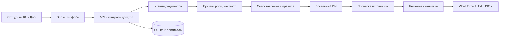

# AI-NAM

Внутреннее приложение для анализа организационных изменений. Сотрудник загружает документы **до и после**, сравнивает подразделения и функции, проверяет отклонения по исходным пунктам и получает редактируемое заключение.

Python/FastAPI, SQLite, светлый интерфейс RU/ҚАЗ, локальный ИИ через Ollama, учётные записи, роли, источники и отчёты. Node.js и внешние CDN для запуска не требуются.

## Быстрый запуск

Нужен Python 3.12+; проверено на Python 3.14.5. В PowerShell из каталога проекта:

```powershell
python -m venv .venv
.\.venv\Scripts\python.exe -m pip install -r requirements.lock.txt
.\.venv\Scripts\python.exe run.py
```

Откройте **http://127.0.0.1:8765**. Создайте первого администратора на компьютере сервера. Общих паролей по умолчанию нет. В дальнейшем можно запускать `./start.ps1`: он подготовит окружение, если его ещё нет.

Linux: `python3 -m venv .venv`, затем `.venv/bin/python -m pip install -r requirements.lock.txt` и `.venv/bin/python run.py`.

### Локальный ИИ

Установите [Ollama](https://ollama.com/download), выполните `ollama pull qwen2.5:7b`. Если служба не запущена — `ollama serve` в отдельном терминале. Приложение обращается к `http://127.0.0.1:11434`. Статус модели показан в «Настройки».

Для изменения параметров скопируйте `.env.example` в `.env`:

```dotenv
AI_PROVIDER=ollama
AI_BASE_URL=http://127.0.0.1:11434
AI_MODEL=qwen2.5:7b
AI_MAX_PAIRS=20
AI_TIMEOUT_SECONDS=180
```

Структурный анализ охватывает весь извлечённый текст. ИИ проверяет до 20 приоритетных спорных соответствий, по одному за запрос, с бюджетом 8 минут плюс завершение текущего запроса. Лимит настраивается до 100. Количество принятых ответов показано в результате. На CPU обработка может занять несколько минут. Предварительный структурный результат доступен до завершения ИИ; при сбое модели он сохраняется. `AI_PROVIDER=none` отключает ИИ.

Поддержан адаптер `AI_PROVIDER=compatible` для сервера с `/chat/completions`: параметры `AI_BASE_URL`, `AI_MODEL`, `AI_API_KEY`, поддержка JSON-ответов. Внешний адрес отмечается в форме, передача отключена по умолчанию. Внутренний сценарий рассчитан на локальный Ollama. Внешний сервис не использовался для отправки пользовательских примеров.

## Полный сценарий на предоставленных примерах

1. Войдите и нажмите **«Открыть пример»** на странице «Обзор».
2. Выберите смысловую проверку ИИ или быстрый структурный анализ; нажмите **«Сравнить документы»**. Настоящие DOCX из `samples` анализируются заново.
3. В **«Подразделения»**: ДНМ и ДККМ сохранены; ДИТААД и ДОА добавлены в явный перечень.
4. В **«Матрица функций»** найдите **5.4.4**. Обязанности и подпункты сопоставлены с **5.3.3**, перенос не объявляется потерей.
5. В **«Риски и выводы»** выберите **«Изменена обязательность»**, откройте **9.15**: «осуществляется» → «может осуществляться».
6. Откройте контекст источника, прочитайте пункт, вернитесь к выводу, оставьте комментарий и подтвердите или отклоните его.
7. Скачайте **Word**, **Excel**, **HTML** или **JSON**. Для PDF откройте автономный HTML: `Ctrl+P` → «Сохранить как PDF».

Word содержит заключение, реестр документов, структуру, все выводы с цитатами и рекомендациями, комментарии проверяющего, матрицу ссылок и ограничения. Excel: четыре листа — выводы, матрица, источники, подразделения. Отчёты формируются на русском; исходные тексты не переводятся. Интерфейс RU/ҚАЗ.

## Доступ и хранение

| Возможность | Администратор | Аналитик | Наблюдатель |
|---|---|---|---|
| Создание сравнения | Да | Да | Нет |
| Проверка вывода | Да | В доступных сравнениях | Нет |
| Чтение и экспорт | Все | Свои и открытые команде | Открытые команде |
| Управление доступом сравнения | Да | Только свои | Нет |
| Пользователи и журнал | Да | Нет | Нет |

Новое сравнение доступно автору и администратору. Кнопка «Личное сравнение» открывает настройки доступа. Открытие команде распространяется на оригиналы, результаты и выгрузки. Права проверяются сервером на каждом запросе.

Каталог `data/`: SQLite, оригиналы, результаты, решения и журнал. Пароли: scrypt с индивидуальной солью; токены сеанса в базе хешируются. Cookie HttpOnly/SameSite=Strict, срок 12 часов. Отключение пользователя, изменение роли и смена пароля завершают прежние сеансы. Журнал не является криптографически неизменяемым.

Шифрование данных на уровне приложения не встроено: для рабочего сервера примените права ОС на каталог данных и шифрование диска. API-ключ модели не возвращается в браузер. `.env`, рабочие данные и тестовые артефакты исключены из git.

### Локальная сеть

Схема: браузеры → HTTPS reverse proxy → FastAPI на loopback. Конфиг: `deploy/Caddyfile.example`. Используйте сертификат организации и доверие к нему на рабочих компьютерах. Завершение TLS описано в [FastAPI](https://fastapi.tiangolo.com/deployment/https/), сертификаты — в [Caddy](https://caddyserver.com/docs/automatic-https).

1. Создайте администратора через localhost до подключения сотрудников.
2. Настройте имя сервера, сертификат и reverse proxy.
3. Задайте в `.env`:

```dotenv
AI_NAM_HOST=127.0.0.1
AI_NAM_ALLOWED_HOSTS=127.0.0.1,localhost,ai-nam.internal
AI_NAM_PUBLIC_ORIGIN=https://ai-nam.internal
AI_NAM_SECURE_COOKIES=true
```

4. Перезапустите приложение. Разрешите HTTPS reverse proxy в firewall только для своей сети. Порты приложения и Ollama наружу не публикуйте.
5. Создайте пользователей в «Команда», проверьте доступ с другого компьютера.

Корпоративный сертификат, сетевой доступ и системную службу настраивает администратор организации. Приложение автоматически не меняет firewall и сертификаты.

Запускайте **один процесс Uvicorn**: два фоновых задания обрабатываются одновременно, ещё два допускаются в очередь. Незавершённые задания после перезапуска отмечаются ошибкой и требуют повторного запуска. Несколько экземпляров на одной базе не поддерживаются.

### Резервная копия

Остановите сервер и выполните:

```powershell
.\.venv\Scripts\python.exe scripts/backup.py --output D:/AI-NAM-backups
```

Скрипт создаёт новый каталог с датой, согласованной SQLite-базой и оригиналами. Для восстановления остановите сервер, сохраните прежний `data`, перенесите содержимое копии в `data` и запустите приложение. `.env` сохраните отдельно в защищённом месте. Копии нельзя размещать внутри `data`.

## Архитектура



| Требование | Реализация |
|---|---|
| Комплекты до/после | Несколько файлов, проверка формата, размеров и повторов |
| Структура | Явные перечни подразделений, состояния и источники |
| Функции | Точные/близкие пары, исполнитель, содержание, обязательность, перенумерация и объединение |
| Потери | Отсутствие пары, ближайший кандидат, оговорка о полноте комплекта |
| Дублирование | Близкие конкретные функции у разных исполнителей, исключение части общих обязанностей |
| Конфликты | Узкое правило самопроверки; отдельно документированные меры независимости |
| Доказательства | Документ, SHA-256, пункт, абзац/страница/ячейки, цитата и роль |
| ИИ | Проверка кандидатов, JSON-схема, белый список источников, частичный результат |
| Сотрудник | Подтверждение/отклонение, комментарий, имя и время проверки |

**Предложенная реализация.** Один локальный сервис упрощает запуск первой внутренней версии. Детерминированное сравнение даёт воспроизводимую основу, ИИ проверяет неоднозначные пары. Источники и решения сотрудников отделены от мнения модели. Номер пункта служит ориентиром, а не доказательством совпадения функции.

**Развитие после пилота.** Собрать проверенный сотрудниками набор и измерить полноту/точность, включая казахские документы. Затем — семантический поиск по всему корпусу, OCR, синонимы подразделений, выделенная очередь, PostgreSQL, SSO/AD, политики хранения. Нормативная проверка и сравнение с эталонными организациями требуют утверждённых источников и сейчас не выполняются.

## Ограничения

- DOCX, PDF с текстовым слоем, XLSX, TXT. DOC/XLS предварительно преобразуйте.
- До **20 файлов с каждой стороны**, **20 МБ на файл**, **100 МБ на комплект**, **300 страниц на PDF**, **5000 фрагментов на документ**, **6000 фрагментов функций на сравнение**. Крупные комплекты разделяйте по подразделениям.
- OCR не встроен. Скан без текста отклоняется с объяснением; частично нечитаемые страницы отмечаются. Ограничение извлечения описано в [pypdf](https://pypdf.readthedocs.io/en/stable/user/extract-text.html).
- Картинки, схемы и Word SmartArt не распознаются. XLSX читается как строки ячеек, формулы не вычисляются. Сложную разметку сверяйте с оригиналом.
- Языковые правила могут пропускать переименования, сложные слияния, сильные перефразирования, функции без исполнителя. Оценка сходства не является вероятностью истинности, вопросы для проверки не являются доказанными нарушениями.
- Модель видит ограниченный набор кандидатов. Валидная ссылка подтверждает наличие цитаты, а не истинность интерпретации. Формат ответа — по [документации Ollama](https://docs.ollama.com/capabilities/structured-outputs).
- История показывает последние 200 доступных сравнений. Нагрузка на множество параллельных сотрудников ещё не измерялась.
- Word создаётся как редактируемый OOXML; открытие, содержание и таблицы проверяются программно. Автоматический визуальный рендер Word/LibreOffice на рабочем месте не настроен. PDF сохраняется из HTML через печать браузера.

## Проверка и исходники

```powershell
.\.venv\Scripts\python.exe -m unittest discover -v
```

Тесты используют отдельные базы `artifacts/test-*`. Проверяются реальные примеры, перенос 5.4.4 → 5.3.3, модальность 9.15, объединение обязанностей, одинаковые документы, источники, форматы, приватность, роли, сеансы, решения и выгрузки, отбрасывание выдуманных ИИ ссылок. Семантическая точность модели на основании этих тестов не заявляется.

```text
app/main.py       API, права, загрузки, задания
app/parsers.py    Извлечение текста и структуры
app/analysis.py   Сопоставление и правила
app/llm.py        Модель и проверка источников
app/storage.py    Пользователи, сеансы, результаты, журнал
app/reports.py    Word, Excel, HTML
web/             Интерфейс RU/ҚАЗ
samples/         Документы пользователя
tests/           Проверки поведения и доступа
deploy/          Пример HTTPS
scripts/         Резервное копирование
```

Задание: [Google Docs](https://docs.google.com/document/d/1m-r31DH6Q__9OcN4WiP453CE6drlTTQ8Px3xi3IiVHk/edit). Источники примеров: [samples/README.md](samples/README.md).
