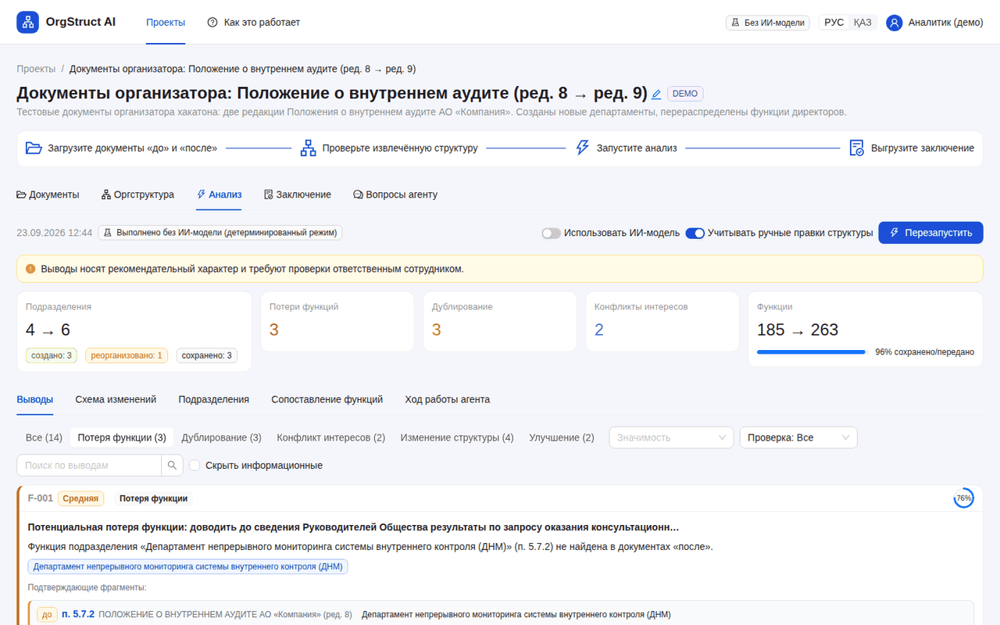
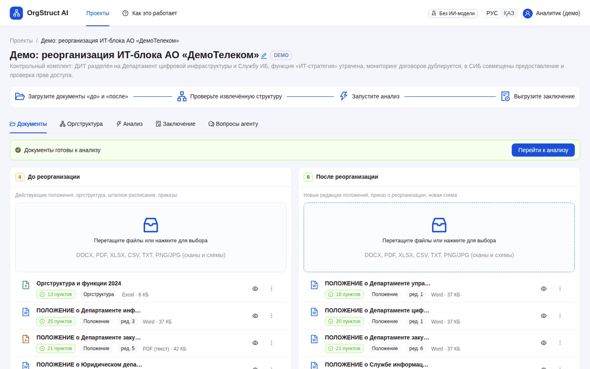
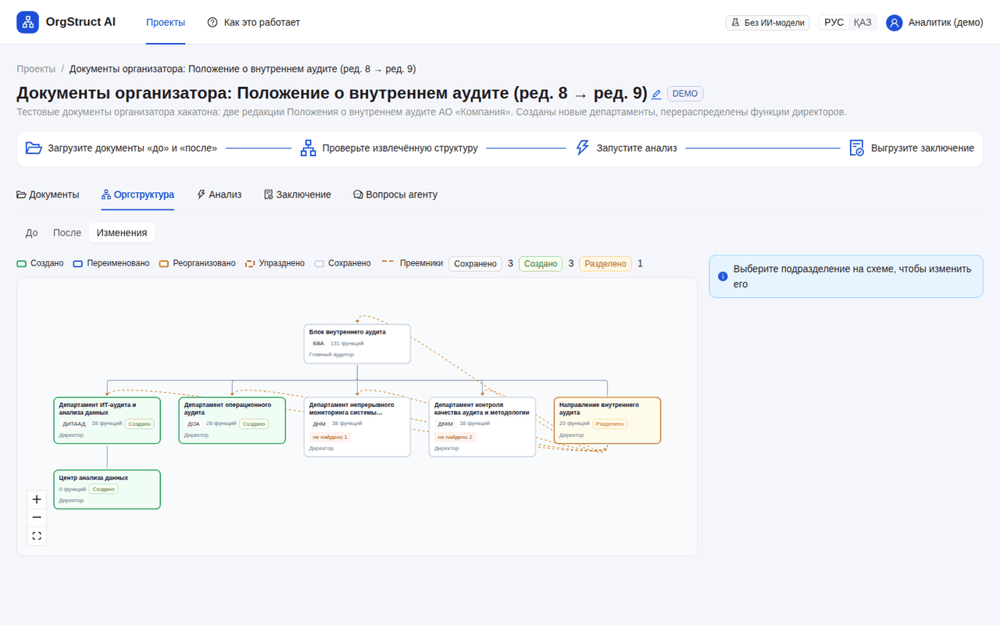
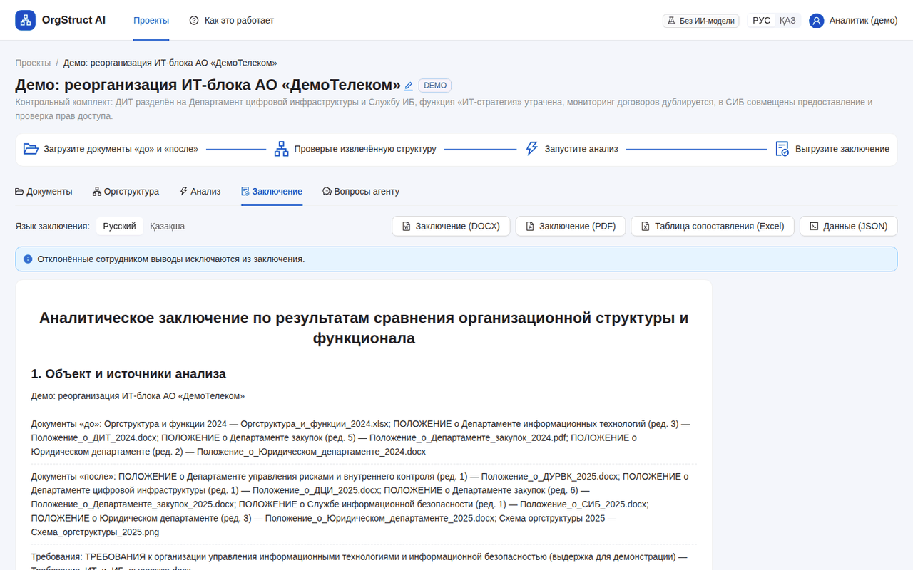
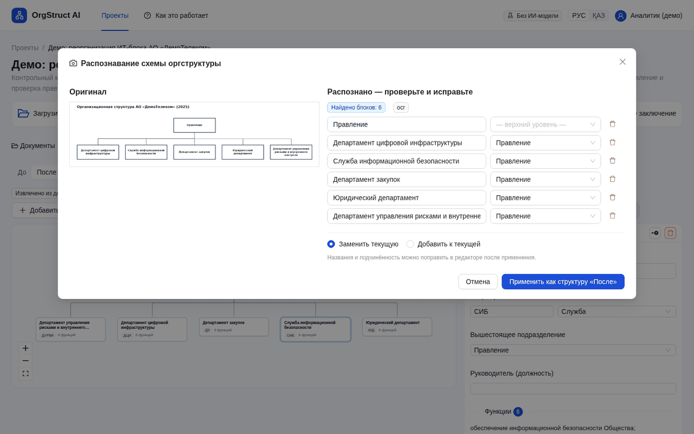
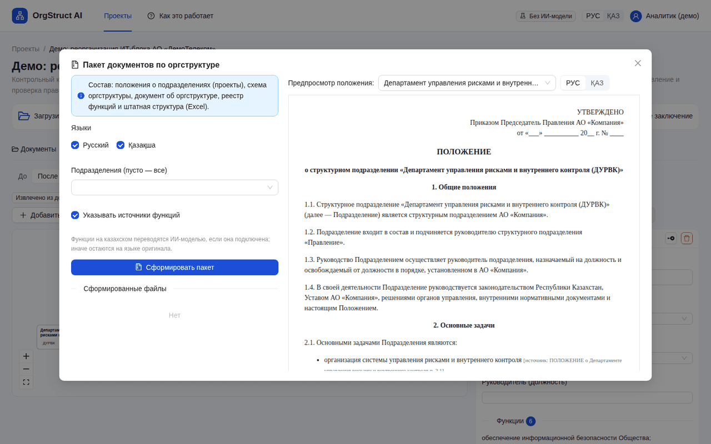
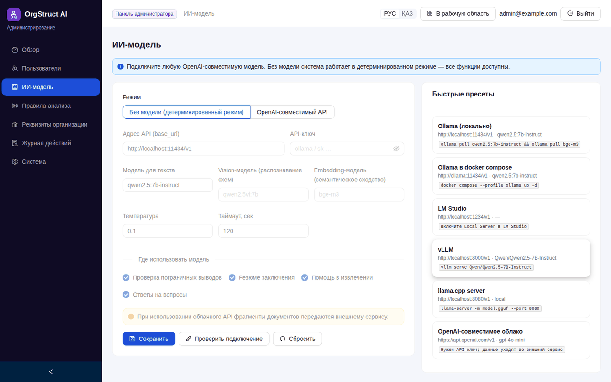
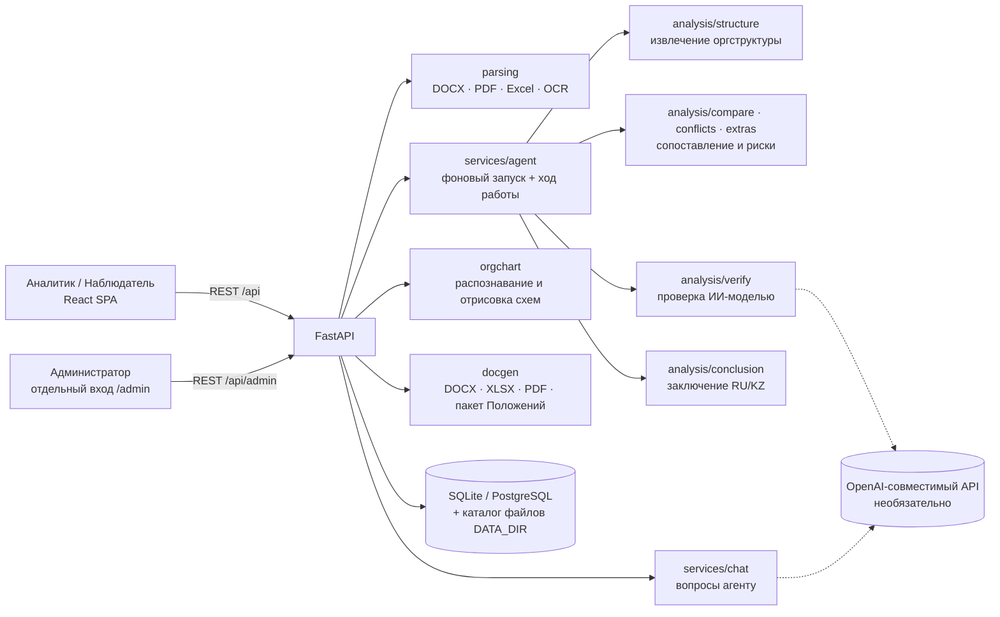

# OrgStruct AI — полное руководство

[Вернуться к мини-презентации](../README.md)

Команды выполняются из корня репозитория, если явно не указан другой каталог. Руководство относится к ветке `claude/sleepy-brown-ql4mry`.

Прототип команды **AI-NAM** для хакатона HackAlem, кейс «ИИ-агент „Анализ организационной структуры и функционала“».

> В репозитории два приложения команды. Этот README описывает основное — **OrgStruct AI** (`backend/`, `frontend/`).
> Второй, облегчённый прототип **AI-NAM** (`app/`, `web/`, `run.py`) запускается отдельно:
> см. [раздел «Второй прототип: AI-NAM»](#второй-прототип-ai-nam) и [docs/AI-NAM.md](../docs/AI-NAM.md).



## Содержание

1. [Название проекта](#1-название-проекта)
2. [Краткое описание](#2-краткое-описание)
3. [Что реализовано](#3-что-реализовано)
4. [Как работает решение](#4-как-работает-решение)
5. [Технологии](#5-технологии)
6. [Архитектура проекта](#6-архитектура-проекта)
7. [Установка и запуск](#7-установка-и-запуск)
8. [Как проверить решение](#8-как-проверить-решение)
9. [Данные и интеграции](#9-данные-и-интеграции)
10. [Ограничения](#10-ограничения)
11. [Deployed-версия](#11-deployed-версия)

[Второй прототип: AI-NAM](#второй-прототип-ai-nam)

---

## 1. Название проекта

**OrgStruct AI** — веб-приложение с ИИ-агентом, который сравнивает организационные и функциональные документы до и после
реорганизации и формирует объяснимое заключение со ссылками на пункты исходных документов.

## 2. Краткое описание

**Проблема.** При реорганизации подразделений организационные структуры, положения о подразделениях и приложения к
распорядительным документам приходится сопоставлять вручную. Из-за этого функции теряются или дублируются, зоны
ответственности пересекаются, возникают потенциальные конфликты интересов.

**Для кого.** Для сотрудника, который анализирует организационные изменения: оргразвитие, HR, внутренний контроль,
внутренний аудит. Администратор настраивает пользователей, ИИ-модель и правила анализа в отдельной панели.

**Что делает.** Пользователь загружает комплекты документов «до» и «после» (Word, PDF, Excel, изображения). Агент определяет,
какие подразделения созданы, сохранены, реорганизованы или упразднены. Он сопоставляет функции, находит потенциальную
потерю функций, дублирование и конфликт интересов и для каждого вывода показывает документ и пункт-источник.
Итог — аналитическое заключение на русском или казахском языке. Выводы носят рекомендательный характер: сотрудник
подтверждает или отклоняет каждый из них.

## 3. Что реализовано

**Работа с документами**
- Загрузка файлов `.docx`, `.pdf`, `.xlsx`, `.xlsm`, `.csv`, `.txt`, `.md`, `.png`, `.jpg`, `.jpeg`, `.tif`, `.tiff`, `.bmp`, `.webp`,
  а также `.doc`, `.rtf`, `.odt` (для них нужен LibreOffice).
- Разбор документа на пункты с сохранением нумерации (`п. 5.3.2`, `пп. «а» п. 5.3.2`), раздела, субъекта («Директор ДНМ:»)
  и страницы. Восстанавливается автоматическая нумерация Word; сканы PDF и изображения распознаются через Tesseract OCR (rus, kaz, eng).
- Excel и таблицы Word распознаются как реестры: подразделение, вышестоящее подразделение, функция, должность, численность.
- Просмотр разобранного документа; по клику на источник вывода нужный пункт подсвечивается.

**Анализ «до / после» (обязательные пункты ТЗ)**
- Извлечение оргструктуры: подразделения и их сокращения, подчинённость, должности, закреплённые функции.
- Статусы подразделений: *создано, сохранено, переименовано, разделено, реорганизовано, образовано слиянием, упразднено*.
- Таблица сопоставления функций: *сохранена, передана (куда), изменена, утрачена, перенесена в общие положения, новая*, с оценкой сходства.
- Потенциальная потеря функций: указывается ближайшая найденная формулировка и её сходство.
- Дублирование функций между подразделениями. Отдельно помечается дублирование «общей и частной нормы» и то, возникло оно после изменений или было раньше.
- Потенциальный конфликт интересов: несовместимые функции в одном подразделении (выполнение ↔ контроль, разработка мер ↔
  контроль исполнения, методология ↔ оценка, консультирование ↔ проверка, исполнение ↔ согласование, подготовка ↔ утверждение,
  учёт ↔ распоряжение активами), двойное подчинение должностей, явные нормы о конфликте интересов в тексте.
- У каждого вывода есть подтверждающие фрагменты: документ, пункт, страница, цитата.
- Проверка сотрудником: подтвердить, отклонить или оставить комментарий. Отклонённые выводы не попадают в заключение.
- Итоговое заключение (RU/KZ): объект и источники, основные выводы, изменения структуры, потери, дублирование, конфликты интересов,
  требования и практика операторов (если загружены), рекомендации, ограничения. Экспорт в DOCX, PDF (при наличии LibreOffice), Excel и JSON.

**Дополнительно (необязательные пункты ТЗ)**
- Сопоставление функций с загруженными требованиями (законодательство, стандарты) и поиск пробелов.
- Сравнение созданных и преобразованных подразделений с документами других операторов.
- Рекомендации к выводам: кому передать утраченную функцию, как разграничить дублирование, как устранить конфликт.

**Сверх ТЗ**
- Визуализация изменений: совмещённая схема «до/после», статусы выделены цветом, стрелки ведут к преемникам.
- Распознавание схемы оргструктуры с изображения или PDF (OpenCV + Tesseract или подключаемая vision-модель) с последующей правкой в редакторе.
- Редактор оргструктуры: перетаскивание блока меняет подчинённость; редактируются названия, функции и должности. Следующий анализ учитывает правки.
- Пакет документов по оргструктуре (ZIP): проекты Положений о подразделениях на русском и казахском со ссылками на источники функций,
  схема (PNG), документ об оргструктуре (DOCX), реестр функций и штатная структура (XLSX).
- «Вопросы агенту»: ответы по документам проекта со ссылками на найденные фрагменты.
- Отдельная панель администратора со своим входом: пользователи и роли, ИИ-модель (пресеты, проверка подключения, список
  моделей на сервере), пороги и словари анализа, реквизиты организации для документов, журнал действий, состояние системы.
- Роли: администратор, аналитик, наблюдатель (только просмотр).
- Интерфейс на русском и казахском языках.
- ИИ-модель необязательна: без неё система работает на правилах, текстовом сходстве и шаблонах.

| Документы | Оргструктура и схема изменений | Заключение |
|---|---|---|
|  |  |  |
| **Распознавание схемы** | **Пакет документов** | **Панель администратора** |
|  |  |  |

## 4. Как работает решение

Основной сценарий пользователя:

1. **Вход** в рабочую область (`/login`) и создание проекта (или открытие демо-примера).
2. **Загрузка документов** в колонки «До реорганизации» и «После реорганизации»; при необходимости — «Требования» и
   «Практика других операторов». Каждый файл разбирается в фоне на пункты.
3. **Проверка оргструктуры** на вкладке «Оргструктура»: агент показывает подразделения, извлечённые из документов.
   При необходимости структуру можно поправить в редакторе или распознать со схемы.
4. **Запуск анализа.** Агент выполняет шаги и показывает ход работы (статус, длительность, лог каждого шага):
   1. разбор документов;
   2. извлечение оргструктуры и функций по сторонам «до» и «после»;
   3. сопоставление подразделений и функций, поиск потерь, дублирования и конфликтов интересов;
   4. проверка требований и практики других операторов (если загружены);
   5. проверка пограничных выводов ИИ-моделью (если подключена);
   6. формирование рекомендаций;
   7. формирование заключения.
5. **Просмотр результатов**: сводка, выводы с источниками и рекомендациями, таблицы подразделений и функций, схема изменений.
   Сотрудник подтверждает или отклоняет выводы.
6. **Результат**: заключение (RU/KZ) в DOCX/PDF, таблица сопоставления в Excel, данные в JSON; при необходимости — пакет
   проектов Положений по новой оргструктуре.

**Роль ИИ-модели.** Выводы формирует детерминированное ядро: правила и текстовое сходство. Подключённая модель
(любой OpenAI-совместимый API) проверяет пограничные сопоставления, дублирование и конфликты («подтверждено / оспорено»),
пишет краткое резюме заключения, отвечает на вопросы и, при наличии, считает эмбеддинги и распознаёт схемы.
Резюме модели принимается, только если каждая ссылка `[F-xxx]` в нём указывает на существующий вывод. Ответ на вопрос
принимается, только если в нём есть ссылки `[S1]…` на найденные фрагменты. Иначе используется шаблонный текст
или список фрагментов.

## 5. Технологии

| Область | Что используется |
|---|---|
| Языки | Python 3.11, TypeScript |
| Backend | FastAPI 0.115, Uvicorn, Pydantic 2, SQLAlchemy 2 (SQLite по умолчанию), PyJWT, httpx |
| Документы | python-docx, PyMuPDF (PDF), openpyxl (Excel), LibreOffice (необязательно: PDF-экспорт, `.doc/.rtf/.odt`) |
| OCR и компьютерное зрение | Tesseract OCR (`rus`, `kaz`, `eng`) через pytesseract, OpenCV (opencv-python-headless), Pillow |
| Текстовое сходство | scikit-learn (TF-IDF по основам слов и символьным n-граммам), Snowball-стеммер, rapidfuzz, NumPy |
| ИИ-модели | Любой OpenAI-совместимый сервер: `/v1/chat/completions`, опционально `/v1/embeddings` и vision. Пресеты в админке: Ollama, LM Studio, vLLM, llama.cpp, OpenAI-совместимое облако. Модели в репозиторий не входят |
| Frontend | React 18, Vite 6, Ant Design 5, React Flow (`@xyflow/react`) + dagre (схемы), TanStack Query, React Router, i18next (RU/KZ), Day.js |
| Инфраструктура | Docker (многоэтапная сборка), Docker Compose с профилем `ollama`, GitHub Actions (тесты, сборка интерфейса и Docker-образа), Makefile |
| Тесты | pytest (20 тестов), FastAPI TestClient, мок-сервер OpenAI-совместимого API (`scripts/mock_llm_server.py`) |

## 6. Архитектура проекта



| Компонент | Путь | Назначение |
|---|---|---|
| Интерфейс | `frontend/src` | Рабочая область (проекты, документы, оргструктура, анализ, заключение, вопросы агенту) и панель администратора |
| API | `backend/app/api` | `auth` (токены рабочей области и админ-панели выдаются разными эндпоинтами и не взаимозаменяемы), `projects`, `analysis`, `admin` |
| Разбор документов | `backend/app/parsing` | Чтение форматов, сегментация на пункты, OCR, сокращения |
| Анализ | `backend/app/analysis` | Извлечение структуры, сопоставление, конфликты интересов, требования и практика, проверка ИИ, рекомендации, заключение |
| Схемы | `backend/app/orgchart` | Распознавание схем (OpenCV + Tesseract / vision-модель), отрисовка PNG |
| Генерация документов | `backend/app/docgen` | Заключение DOCX/PDF, таблица XLSX, пакет Положений RU/KZ |
| Сервисы | `backend/app/services` | Агент-оркестратор, LLM-клиент, документы, чат, настройки, журнал, демо-данные |
| Совместимость | `structure_matcher.py` | `compare_departments()` из первого прототипа команды, реализована поверх движка |

Структура репозитория:

```
backend/            FastAPI-приложение и тесты (backend/tests)
frontend/           React-интерфейс
samples/demo/       синтетический контрольный комплект (генератор: scripts/make_demo.py)
samples/organizer/  документы организатора: Положение о внутреннем аудите, ред. № 8 и № 9
scripts/            генератор демо-данных, мок ИИ-модели, запуск dev/Windows
docs/               ARCHITECTURE.md (алгоритмы), MODELS.md (подключение моделей), AI-NAM.md, скриншоты
Dockerfile, docker-compose.yml, Makefile, .env.example, .github/workflows/ci.yml

Второй прототип AI-NAM (не зависит от файлов выше):
app/, web/, run.py  приложение и интерфейс
tests/              тесты unittest
deploy/             пример HTTPS reverse proxy (Caddy)
scripts/backup.py, start.ps1, requirements.txt, requirements.lock.txt
samples/audit-v8.docx, samples/audit-v9.docx  документы организатора (копия samples/organizer)
```

Подробное описание алгоритмов, модели данных и эндпоинтов: [docs/ARCHITECTURE.md](../docs/ARCHITECTURE.md).

## 7. Установка и запуск

### Вариант 1. Docker Compose

Требуется Docker с Compose v2.

```bash
git clone --branch claude/sleepy-brown-ql4mry https://github.com/BAITC-Hacks/hack-8cb43e3f-ai-nam.git
cd hack-8cb43e3f-ai-nam
cp .env.example .env          # необязательно: без .env используются значения по умолчанию
docker compose up -d --build
```

Приложение: **http://localhost:8000**. Образ включает интерфейс, Tesseract (rus, kaz, eng) и LibreOffice.
Облегчённая сборка без LibreOffice: `docker compose build --build-arg INSTALL_LIBREOFFICE=false`.

### Вариант 2. Локально без Docker

Для воспроизводимого окружения используйте Python 3.11 и Node.js 22 — эти версии заданы в CI. Необязательно: Tesseract OCR с языками `rus` и `kaz`
(для сканов и изображений), LibreOffice (для экспорта в PDF и чтения `.doc/.rtf/.odt`).

```bash
make setup      # создаёт .venv, ставит зависимости Python и npm, собирает интерфейс
make backend    # http://localhost:8000
```

Без `make`:

```bash
python3 -m venv .venv && . .venv/bin/activate
pip install -r backend/requirements-dev.txt
cd frontend && npm ci && npm run build && cd ..
cd backend && uvicorn app.main:app --host 127.0.0.1 --port 8000
```

Windows (PowerShell): `powershell -ExecutionPolicy Bypass -File scripts\start.ps1`.
Установка Tesseract: Ubuntu — `sudo apt install tesseract-ocr tesseract-ocr-rus tesseract-ocr-kaz`; Windows — путь к
`tesseract.exe` указывается в `.env` (`TESSERACT_CMD`).

Режим разработки (backend с автоперезагрузкой + Vite на http://localhost:5173): `make dev`.

### Учётные записи по умолчанию

При первом запуске создаются администратор из `.env` и, если `SEED_DEMO=true` (по умолчанию), демо-пользователи
и два демо-проекта с готовыми результатами анализа.

| Вход | Адрес | Логин / пароль |
|---|---|---|
| Рабочая область, аналитик | `/login` | `analyst@example.com` / `analyst12345` |
| Рабочая область, наблюдатель | `/login` | `viewer@example.com` / `viewer12345` |
| Панель администратора | `/admin/login` | `admin@example.com` / `admin12345` (`ADMIN_EMAIL`, `ADMIN_PASSWORD`) |

### Подключение ИИ-модели (необязательно)

Через **Панель администратора → ИИ-модель** (выбрать пресет → «Проверить подключение» → «Сохранить») или через `.env`:

```bash
LLM_PROVIDER=openai
LLM_BASE_URL=http://localhost:11434/v1      # Ollama; из Docker: http://host.docker.internal:11434/v1
LLM_MODEL=qwen2.5:7b-instruct
LLM_EMBED_MODEL=bge-m3                      # необязательно
LLM_VISION_MODEL=                           # необязательно (распознавание схем)
```

Ollama внутри Compose: заполните `.env` как выше с `LLM_BASE_URL=http://ollama:11434/v1` и запустите
`docker compose --profile ollama up -d --build`. Сервис `ollama-pull` скачает указанные модели.
Проверить ИИ-режим без модели можно на мок-сервере: `make mock-llm`, затем в админке указать
`http://localhost:11500/v1` и модель `mock-model`. Подробнее: [docs/MODELS.md](../docs/MODELS.md).

Все параметры окружения с пояснениями — в [`.env.example`](../.env.example).

## 8. Как проверить решение

### Сценарий 1. Документы организатора (Положение о внутреннем аудите, ред. № 8 → № 9)

1. Откройте http://localhost:8000, войдите как `analyst@example.com` / `analyst12345`.
2. На главной нажмите **«Открыть демо-пример» → «Документы организатора…»** (проект создаётся при первом запуске).
3. Вкладка **«Анализ»** содержит готовый результат; кнопка «Перезапустить» запускает агента заново и показывает ход работы.
   Ожидаемые выводы (проверяются тестом `backend/tests/test_organizer_scenario.py`):
   - **созданы** Департамент ИТ-аудита и анализа данных (ДИТААД) и Департамент операционного аудита (ДОА);
     БВА, ДНМ и ДККМ **сохранены**; «Направление внутреннего аудита» из ред. № 8 **разделено** между департаментами;
   - **потенциальная потеря функций** (права из ред. № 8, не найденные в ред. № 9): п. 5.6.2 «формировать группы контроля
     качества…», п. 5.6.3 «выносить предложения по объему и содержанию внешней оценки БВА…» (ДККМ), п. 5.7.2 «доводить до
     сведения Руководителей Общества результаты по запросу оказания консультационных услуг» (ДНМ);
   - **дублирование общей и частной нормы**: п. 5.3 (для всех директоров департаментов) и п. 5.4 (Директор ДНМ);
   - **конфликт интересов**: нормы о потенциальном конфликте при совмещении (п. 4.4 ред. № 9), совмещение разработки
     мер и контроля их исполнения, **устранённое двойное подчинение** «Директор проектов ДККМ» (ред. № 8, п. 3.6 и п. 3.8).
4. Нажмите на любой подтверждающий фрагмент: откроется документ с подсвеченным пунктом.
5. Вкладка **«Оргструктура» → «Изменения»** показывает схему «до/после» с цветными статусами.
6. Вкладка **«Заключение»**: переключите язык RU/KZ и скачайте DOCX, PDF или Excel.

### Сценарий 2. Синтетический контрольный комплект (п. 11 ТЗ)

Проект **«Демо: реорганизация ИТ-блока АО «ДемоТелеком»»** построен на комплекте `samples/demo` с заранее заложенными
изменениями ([описание](../samples/README.md)). Проверяется тестом `backend/tests/test_demo_scenario.py`.

| Заложено | Ожидаемый вывод агента |
|---|---|
| Департамент информационных технологий разделён на Департамент цифровой инфраструктуры и Службу ИБ | ДИТ — «разделено», ДЦИ и СИБ — «создано» |
| Департамент внутреннего контроля и рисков переименован | «переименовано» |
| Функция «разработка и актуализация ИТ-стратегии» никому не передана | «потенциальная потеря функции» (Положение о ДИТ, п. 3.1) и пробел по требованию (п. 1.1 выдержки требований) |
| Мониторинг исполнения договоров закреплён за Департаментом закупок и Юридическим департаментом | «дублирование функции» |
| Служба ИБ и предоставляет права доступа, и проверяет их правомерность | «конфликт интересов: совмещение выполнения и контроля» |

### Сценарий 3. Свои документы

«Новый проект» → загрузите документы в колонки «до» и «после» → «Анализ» → «Запустить анализ».

### Сценарий 4. Панель администратора

Войдите на `/admin/login` как администратор: пользователи, ИИ-модель, правила анализа, журнал действий.
Вход под `analyst@example.com` на `/admin/login` отклоняется. Токен рабочей области не даёт доступа к `/api/admin/*`
(проверяется тестом `test_admin_scope_separation`).

### Автотесты

```bash
make test      # 20 тестов pytest
```

Тесты проверяют разбор нумерации и сокращений, оба контрольных сценария, сквозной сценарий через HTTP API
(загрузка → анализ → проверка вывода → заключение KZ → выгрузки → пакет документов → вопросы агенту), роль
наблюдателя, разделение входа администратора и ИИ-режим на мок-сервере. Те же тесты, сборка интерфейса, сборка
Docker-образа и тесты второго прототипа AI-NAM запускаются в GitHub Actions (`.github/workflows/ci.yml`).

## 9. Данные и интеграции

- **Входные данные** — документы, которые загружает пользователь. Они хранятся локально в каталоге `DATA_DIR`
  (по умолчанию `./data`, в Docker — том `app-data`), метаданные и результаты — в SQLite (`DATABASE_URL` позволяет указать другую БД).
- **Демо-данные в репозитории:**
  - `samples/organizer` — тестовые документы организатора хакатона: две редакции Положения о внутреннем аудите АО «Компания»;
  - `samples/demo` — синтетический комплект АО «ДемоТелеком» (DOCX, PDF, Excel, PNG-схема, требования, пример
    «практики оператора»), генерируется скриптом `scripts/make_demo.py`.
- **Внешние сервисы по умолчанию не используются**: разбор, OCR, анализ и генерация документов выполняются локально.
- **Необязательная интеграция — ИИ-модель** через OpenAI-совместимый API (локальный сервер или облачный провайдер).
  При облачном провайдере фрагменты документов передаются этому сервису; в админке об этом предупреждение.
- **Локальные инструменты**: Tesseract OCR (изображения и сканы), LibreOffice (PDF-экспорт, старые форматы Word) —
  оба необязательны; в Docker-образе установлены.
- **API самой системы**: REST под `/api`, интерактивная документация OpenAPI — `http://localhost:8000/api/docs`.
  Результаты выгружаются в DOCX, PDF, XLSX, JSON и ZIP (пакет документов).

## 10. Ограничения

- Выводы **рекомендательные** и требуют проверки ответственным сотрудником.
- Извлечение структуры рассчитано на типичное оформление положений: нумерованные пункты, перечни под заголовком-ролью
  («Директор ДНМ:»), заголовки «Положение о …», определения с сокращениями. Для документов другого вида структуру может
  понадобиться поправить в редакторе.
- Сходство формулировок статистическое (TF-IDF). Без embedding-модели перефразирования с разной лексикой могут не
  сопоставиться, и функция будет отмечена как потенциально утраченная. Пороги настраиваются в админке.
- ИИ-режим проверен автотестами на мок-сервере OpenAI-совместимого API. Качество работы с конкретными моделями
  (Qwen, Llama и др.) в репозитории не измерялось; модели в пресетах — рекомендации.
- Качество OCR зависит от качества изображения. Распознавание схем рассчитано на прямоугольные блоки,
  соединённые линиями. Рукописный текст не поддерживается.
- Интерфейс, заключение и шаблоны Положений переведены на казахский. Анализ казахоязычных исходных документов не тестировался:
  стемминг настроен на русский язык.
- Все пользователи видят все проекты; разграничения доступа на уровне проекта нет (есть только роли).
- Анализ выполняется в фоновом потоке процесса приложения; очереди задач и горизонтального масштабирования нет.
- Нет интеграций с СЭД и HR-системами, нет версионирования структуры по датам приказов.

## 11. Deployed-версия

Публично развёрнутой версии нет. Запуск: локально или в Docker ([раздел 7](#7-установка-и-запуск)).

## Второй прототип: AI-NAM

Облегчённое приложение команды на FastAPI и SQLite с интерфейсом RU/ҚАЗ без Node.js: сравнение комплектов документов
«до/после», матрица функций, риски и выводы с источниками, решение аналитика, выгрузка в Word, Excel, HTML и JSON,
локальный ИИ через Ollama. Код не пересекается с OrgStruct AI. Полное описание: [docs/AI-NAM.md](../docs/AI-NAM.md).

```bash
python3 -m venv .venv-ainam
.venv-ainam/bin/python -m pip install -r requirements.lock.txt
.venv-ainam/bin/python run.py                          # http://127.0.0.1:8765
.venv-ainam/bin/python -m unittest discover -v         # 28 тестов (каталог tests/)
```

Windows: корневой `start.ps1` запускает AI-NAM; OrgStruct AI запускается через `scripts\start.ps1`.
Первого администратора AI-NAM создают на компьютере сервера, паролей по умолчанию нет. Переменные AI-NAM
(`AI_*`, `AI_NAM_*`) собраны во втором блоке `.env.example`. Оба приложения по умолчанию хранят данные в `./data`
в разных файлах (`app.db` и `app.sqlite3`). Отдельный каталог задаётся через `DATA_DIR` или `AI_NAM_DATA_DIR`.

---

<details>
<summary>Қазақша қысқаша</summary>

**OrgStruct AI** — қайта ұйымдастыруға дейінгі және кейінгі құжаттарды (Word, PDF, Excel, суреттер) салыстыратын ЖИ-агент.
Ол құрылған, сақталған, қайта ұйымдастырылған және таратылған бөлімшелерді анықтайды, функцияларды салыстырады,
функциялардың ықтимал жоғалуын, қайталануын және мүдделер қақтығысын табады. Әрбір қорытынды құжат тармағына сілтемемен беріледі.
Қорытындыны орыс немесе қазақ тілінде DOCX, PDF немесе Excel түрінде жүктеп алуға болады.
Іске қосу: `docker compose up -d --build` → http://localhost:8000 (әкімші панелі: `/admin/login`).
Интерфейс тілі жоғарғы оң жақтағы **РУС / ҚАЗ** ауыстырғышымен ауыстырылады.

</details>
